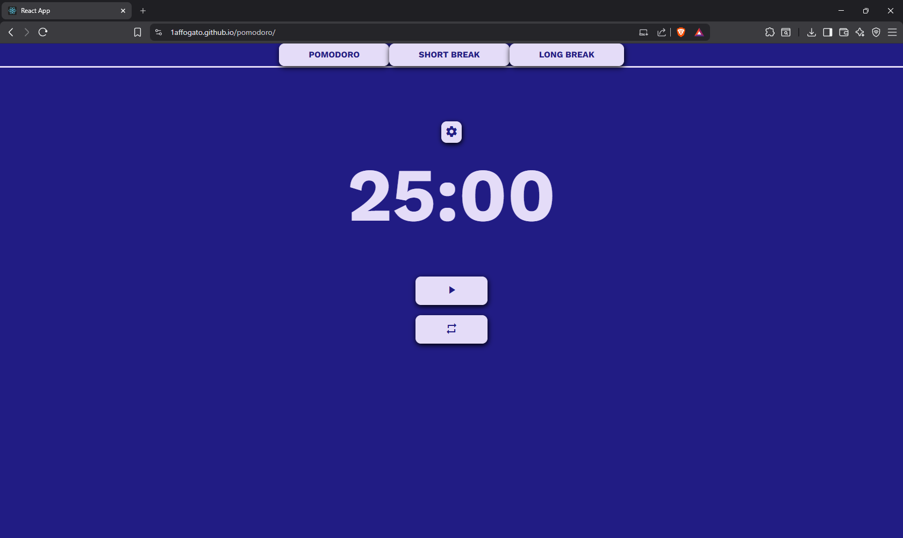
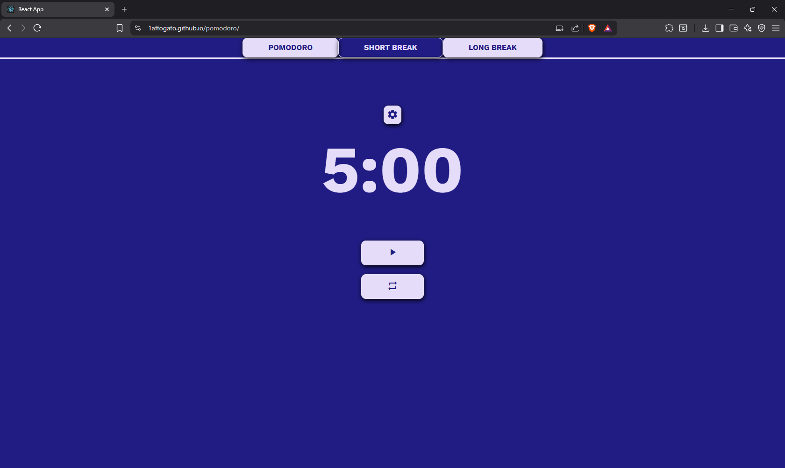
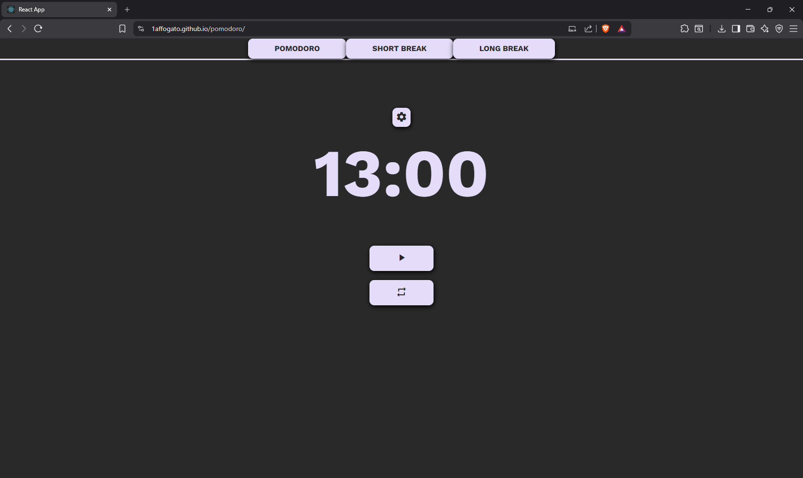
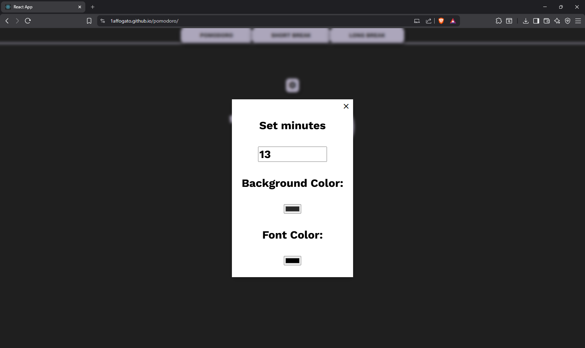

# Pomodoro Timer

A productivity-focused Pomodoro application built with React that helps users manage work sessions, short breaks, and long breaks. The application provides customizable timers, progress tracking, and interface personalization through color settings.

---

## Features

* Pomodoro work timer
* Short break timer
* Long break timer
* Start and pause functionality
* Timer reset functionality
* Real-time countdown
* Progress bar visualization
* Custom session duration
* Background color customization
* Font color customization
* Responsive user interface
* Component-based React architecture

---

## Tech Stack

* React
* JavaScript
* CSS
* HTML

---

## Screenshots

### Pomodoro Session


### Short Break


### Long Break


### Settings Panel


---

## How to Run

### Clone the repository

```text
git clone https://github.com/1affogato/pomodoro.git

cd pomodoro
```

### Install dependencies

```text
npm install
```

### Start the development server

```text
npm start
```

### Open

```text
http://localhost:3000
```

---

## Application Modes

### Pomodoro

Focused work session designed to maximize productivity.

Default duration:

```text
25 minutes
```

### Short Break

Short recovery period between work sessions.

Default duration:

```text
5 minutes
```

### Long Break

Extended recovery period after multiple Pomodoro sessions.

Default duration:

```text
15 minutes
```

---

## Customization

The application allows users to customize:

* Session duration
* Background color
* Font color

Settings can be modified through the integrated settings panel.

---

## Project Structure

```text
pomodoro/

│
├── public/
│
├── src/
│   ├── components/
│   │   ├── TimerGestord.js
│   │   ├── TimerPomodoro.js
│   │   ├── TimerShortBreak.js
│   │   └── TimerLongBreak.js
│   │
│   ├── App.js
│   ├── App.css
│   ├── index.js
│   └── index.css
│
├── package.json
├── package-lock.json
└── README.md
```

---

## Architecture

```text
User Interface
      │
      ▼
 Timer Manager
      │
      ├─────────────┬─────────────┐
      ▼             ▼             ▼
 Pomodoro      Short Break    Long Break
      │             │             │
      ▼             ▼             ▼
 Timer Logic  Timer Logic  Timer Logic
      │
      ▼
 State Management
      │
      ▼
 Real-Time Countdown
      │
      ▼
 Progress Tracking
```
